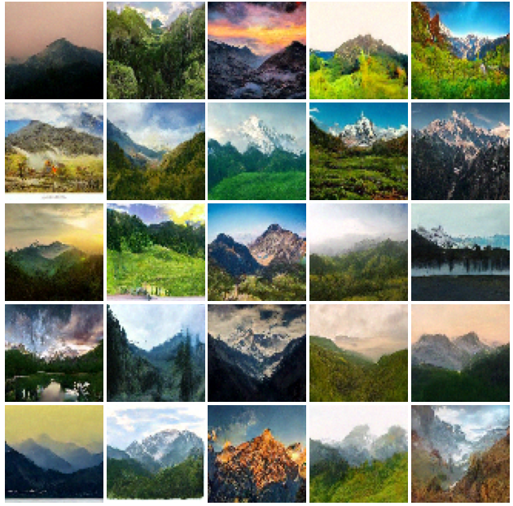
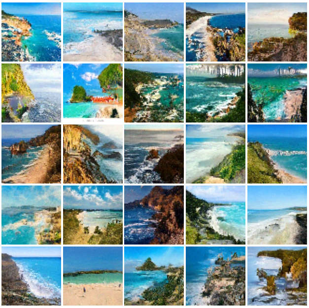

# Diffusion Model -- TensorFlow & Keras
Diffusion models are a fascinating use of deep learning for simulating the gradual evolution of data over time. 
The concept behind generation using diffusion model is to iteratively transform a data point from a noise to a target distribution which is the original data distribution. This transformation is performed through a series of discrete steps. The training stage involves forward diffusion and backward diffusion.  
<br>
In the forward diffusion process, we gradually add gaussian noise to the data for a random number of time steps 't' ('t' less than or equal to total number of predetermined time steps) resulting in a noised image. In the reverse diffusion process, we begin with the noised image (noised for 't' steps in forward diffusion) and we train a UNet model, which aids in lowering the noise level by predicting the noise added to the original image.


For Generating new images, we simply perform reverse diffusion iteratively. To do this, we first sample noise from a standard gaussian and we predict and remove the noise gradually over the predetermined number of time steps which results in producing a image that resembles the original data distribution.

  

**Dataset used**  
i) https://www.kaggle.com/datasets/utkarshsaxenadn/landscape-recognition-image-dataset-12k-images

  
**Results**  

<p float="left">
  
   
</p>


**Usage**  

Training 

```python  
# Dataset format {'image' : image_batch, 'context' : label_batch }
# Create 'results' folder to store sampled images.

train = tf.keras.utils.image_dataset_from_directory(
     "/kaggle/input/landscape-recognition-image-dataset-12k-images/Landscape Classification/Landscape Classification/Training Data",
     batch_size = 10,
     labels = 'inferred',
     image_size = (64,64),
     seed = 42,
)
val = tf.keras.utils.image_dataset_from_directory(
     "/kaggle/input/landscape-recognition-image-dataset-12k-images/Landscape Classification/Landscape Classification/Validation Data",
     batch_size = 10,
     labels = 'inferred',
     image_size = (64,64),
     seed = 42,
)

def preprocess(img,lab):
    return {'image' : img/255,'context' : tf.reshape(lab + 1,shape = (-1,1))}

train = train.map(preprocess,num_parallel_calls = tf.data.experimental.AUTOTUNE)
val = val.map(preprocess,num_parallel_calls = tf.data.experimental.AUTOTUNE)

# Create trainer instance (trainer.py)
trainer = Trainer(epochs=500, 
                  lr=1e-4,
                  time_steps=1000,
                  num_classes=5,
                  cfg_weight=3,
                  image_size=64,
                  ema_start=3)

# To Start training
trainer.train(train_ds,val_ds)

# To Test ('use_main' = False  to test using EMA Model)
trainer.evaluate(val_ds,use_main=False)
```

Generating Images (generate_images.py) 

```python

# Create model instance and load weights
model = UNet(time_steps=1000, input_size=64, num_classes=5)
model.load_weights("directory")
interpolate_weight = 3

@tf.function(input_signature=[tf.TensorSpec(shape=(None, 64, 64, 3), dtype=tf.float32),
                              tf.TensorSpec(shape=(), dtype=tf.int32),
                              tf.TensorSpec(shape=(None, 1), dtype=tf.int32)])
def reverse_diffusion(images, time, label):
    batch = tf.shape(images)[0]
    time = tf.repeat(time, repeats=batch, axis=0)

    alpha = tf.gather(model.alphas, time)[:, None, None, None]
    beta = tf.gather(model.betas, time)[:, None, None, None]
    alpha_hat = tf.gather(model.alpha_hats, time)[:, None, None, None]

    time = tf.expand_dims(time, axis=-1)
    zero_labels = tf.fill(dims=tf.shape(label), value=0)

    predicted_noise_uncond = model([images,
                                    time,
                                    zero_labels])
    predicted_noise_cond = model([images,
                                  time,
                                  label])

    predicted_noise = predicted_noise_uncond + interpolate_weight * (
            predicted_noise_cond - predicted_noise_uncond)

    if time[0] > 1:
        noise = tf.random.normal(shape=tf.shape(images))
    else:
        noise = tf.zeros_like(images)

    images = (1 / tf.sqrt(alpha)) * (images - ((1 - alpha) / (tf.sqrt(1 - alpha_hat))) * predicted_noise) + tf.sqrt(
        beta) * noise
    return images


def generate(no_of, class_no):
    images = tf.random.normal((no_of, model.input_size, model.input_size, 3))
    for t in reversed(range(1, model.time_steps)):
        images = reverse_diffusion(
            images,
            tf.constant(t, dtype=tf.int32),
            tf.expand_dims(class_no,axis=-1)
        )
    images = tf.clip_by_value(images, 0, 1)
    return images

# Run the generate function (no_of : number of images to generate, class_no : [1,5])
generated_images = generate(no_of,class_no) 

```

  
**References**  
i) https://github.com/dome272/Diffusion-Models-pytorch

